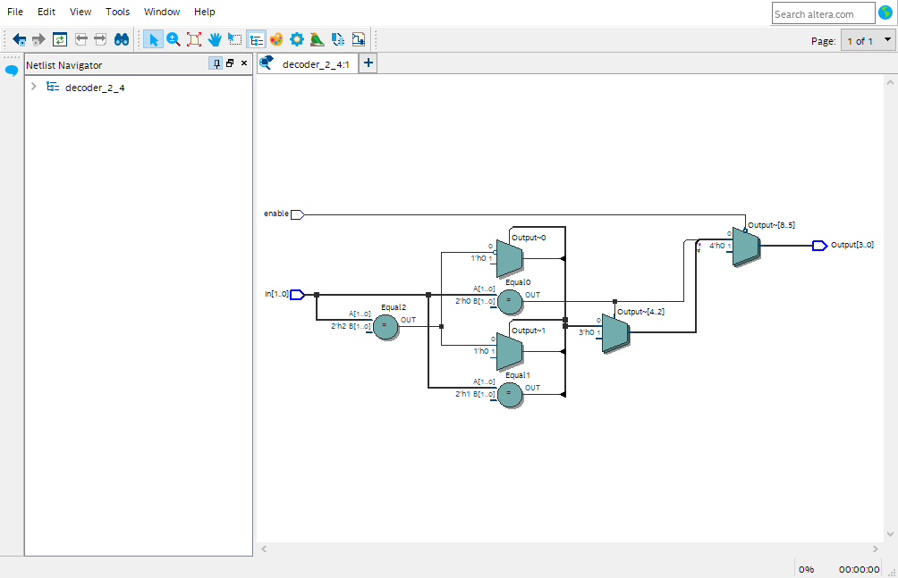
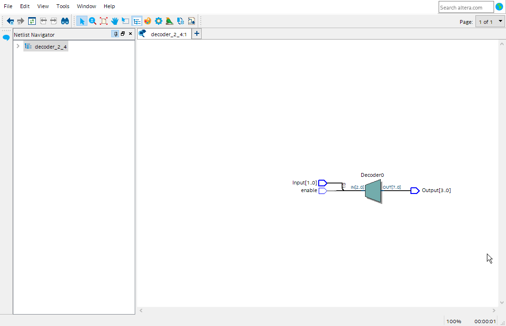
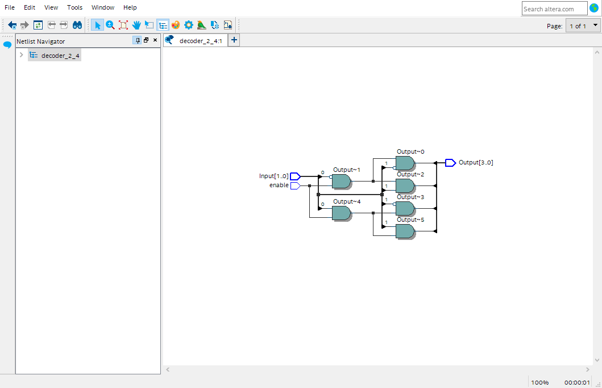
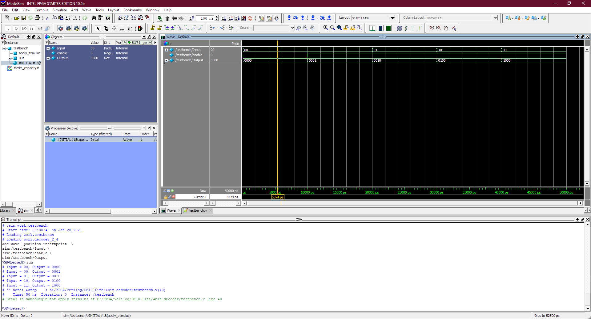

#  4bit to 2bit Binary  Decoder

## Truth Table
En | Input | OutPut
---|-------|-------
0  | XX    | 0000
1  | 00    | 0001
1  | 01    | 0010
1  | 10    | 0100
1  | 11    | 1000

## using if else method
```verilog
module decoder_2_4(input [1:0] Input,
						 input enable,
						 output reg[3:0] Output);
		always  @*
			if (enable == 0 ) 
				Output = 4'b0000;
			else if( Input == 2'b00 ) 
				Output = 4'b0001;
			else if( Input == 2'b01 ) 
				Output = 4'b0010;
			else if( Input == 2'b10 ) 
				Output = 4'b0100;
			else 
				Output = 4'b1000;
endmodule	
```



## using case method
```verilog
module decoder_2_4(input [1:0] Input,
						 input enable,
						 output reg[3:0] Output);
		always @*
			case ({enable,Input})    //total 3bit
				3'b000, 3'b001, 3'b010, 3'b011: Output = 4'b0000;
				3'b100: Output = 4'b0001;
				3'b101: Output = 4'b0010;
				3'b110: Output = 4'b0100;
				3'b111: Output = 4'b1000;
			endcase
endmodule	
```


## using continuous assignment
```verilog
module decoder_2_4(input [1:0] Input,
						 input enable,
						 output [3:0] Output);

assign Output[0] = enable & ~Input[0] & ~Input[1];						 
assign Output[1] = enable & ~Input[0] &  Input[1];		
assign Output[2] = enable &  Input[0] & ~Input[1];
assign Output[3] = enable &  Input[0] &  Input[1];
		
endmodule	
```



## Test Bench Waveform and Result 


