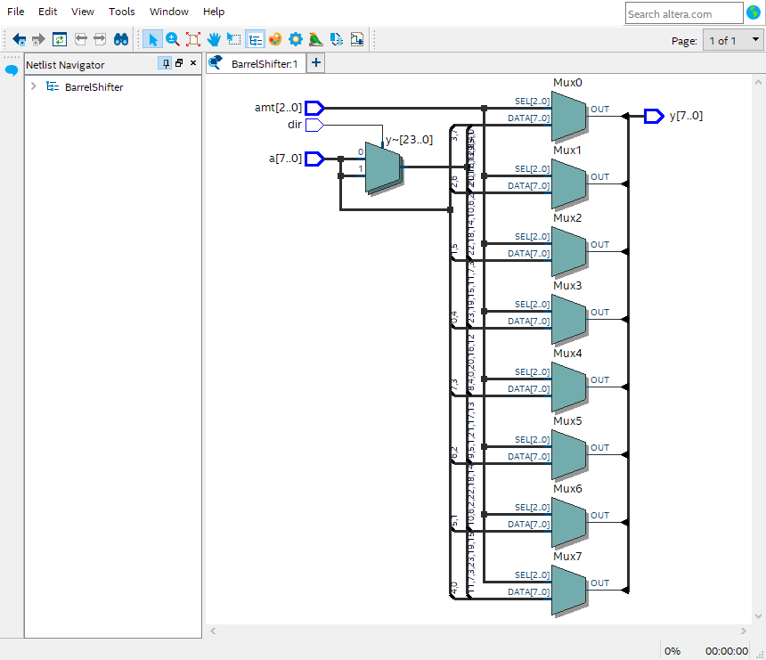
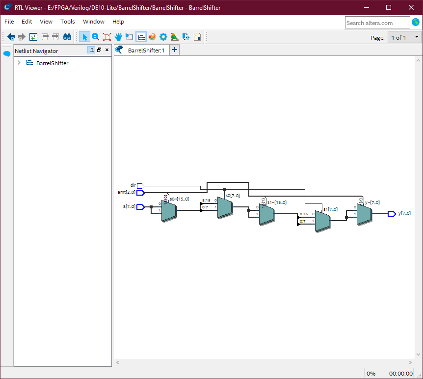
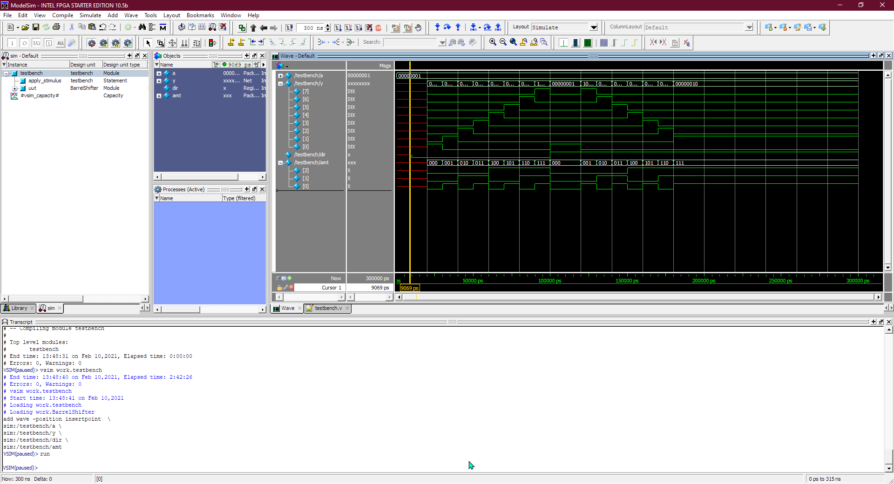

#  8 bit Barrel Shifter

## using single stage multiplexers
```verilog
module BarrelShifter(
input[7:0] a,       //input data
input[2:0] amt,     //shift amount(0-7)
input dir,          //0->LeftShift, 1->RightShift
output reg [7:0] y);//shifted result

always @* begin
	case(amt)
	3'd0: y <= a;
	3'd1: y <= ( dir == 1'b1 ) ? {a[0  ], a[7:1]} : {a[6:0], a[7  ]};
	3'd2: y <= ( dir == 1'b1 ) ? {a[1:0], a[7:2]} : {a[5:0], a[7:6]}; 
	3'd3: y <= ( dir == 1'b1 ) ? {a[2:0], a[7:3]} : {a[4:0], a[7:5]};
	3'd4: y <= ( dir == 1'b1 ) ? {a[3:0], a[7:4]} : {a[3:0], a[7:4]};
	3'd5: y <= ( dir == 1'b1 ) ? {a[4:0], a[7:5]} : {a[2:0], a[7:3]}; 
	3'd6: y <= ( dir == 1'b1 ) ? {a[5:0], a[7:6]} : {a[1:0], a[7:2]};
	3'd7: y <= ( dir == 1'b1 ) ? {a[6:0], a[7  ]} : {a[0  ], a[7:1]};
	endcase
end
endmodule
```



```verilog
module BarrelShifter(
input[7:0] a,       //input data
input[2:0] amt,     //shift amount(0-7)
input dir,          //0->LeftShift, 1->RightShift
output [7:0] y);//shifted result

wire [7:0] s0,s1;

assign s0 = ( dir ) ? (( amt[0] == 1'b1 ) ? {a [0  ],a [7:1]} :  a) : //Right Shift 1bit
                      (( amt[0] == 1'b1 ) ? {a [6:0],a [7  ]} :  a) ; //Left  Shift 1bit
assign s1 = ( dir ) ? (( amt[1] == 1'b1 ) ? {s0[1:0],s0[7:2]} : s0) : //Right Shift 2bits
                      (( amt[1] == 1'b1 ) ? {s0[5:0],s0[7:6]} : s0) ; //Left  Shift 2bits	
assign y  = ( amt[2] == 1'b1 ) ? {s1[3:0],s1[7:4]} : s1;            //Shift 4bits
								  
endmodule
```


## Test Bench Waveform and Result 
