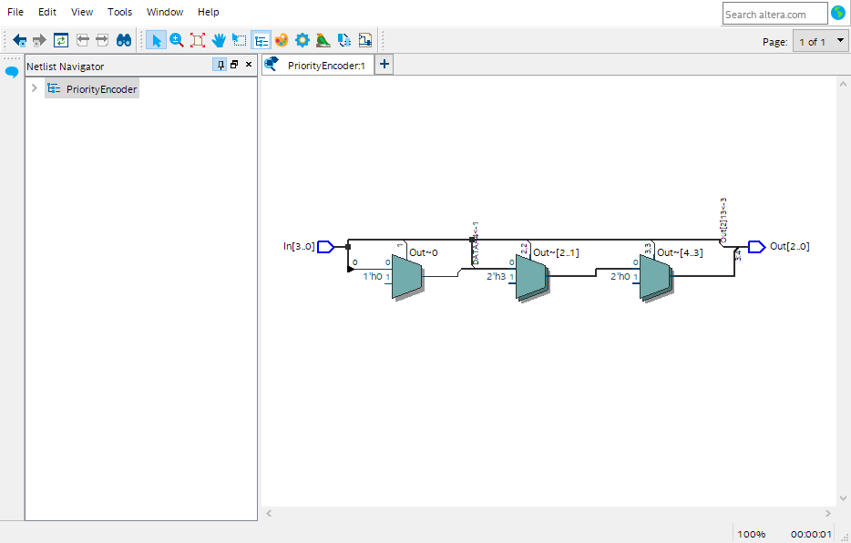
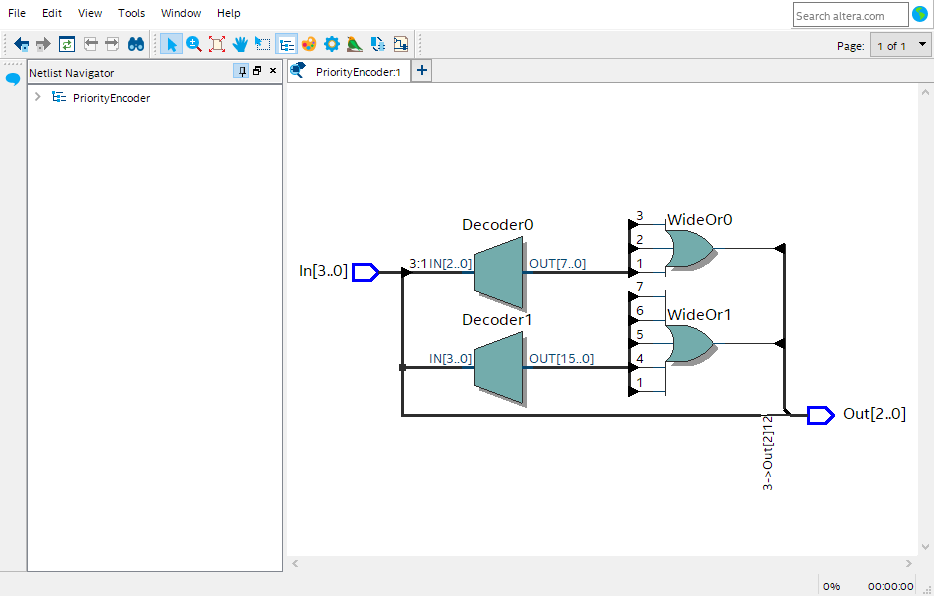
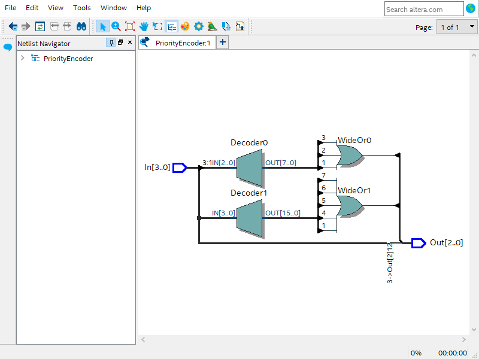
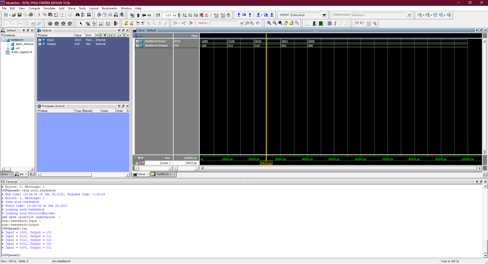

#  4bit Priority Encoder

## Truth Table
Input | OutPut
------|-------
1XXX  | 100
01XX  | 011
001X  | 010
0001  | 001
0000  | 000

## using if else operator
```verilog
module PriorityEncoder(input [3:0] In,
                       output reg[2:0] Out);
			
   always @*
	begin 
	if(In[3] == 1'b1)
	    Out = 3'b100;
	else if(In[2] == 1'b1)
	    Out = 3'b011;
	else if(In[1] == 1'b1)
	    Out = 3'b010;
	else if(In[0] == 1'b1)
	    Out = 3'b001;
	else 
	    Out = 3'b000;
	end			
endmodule
```


## using case statement
```verilog
module PriorityEncoder(input [3:0] In,
                       output reg[2:0] Out);
		
	always @*	
   case(In)
		4'b1000,4'b1001,4'b1010,4'b1011,
		4'b1100,4'b1101,4'b1110,4'b1111:
		Out = 3'b100;
		
		4'b0100,4'b0101,4'b0110,4'b0111:
		Out = 3'b011;
		
		4'b0011,4'b0010:
		Out = 3'b010;
		
		4'b0001:
		Out = 3'b001;
		
		4'b0000:
		Out = 3'b000;
	endcase		
endmodule
```


## using casez statement
```verilog
module PriorityEncoder(input [3:0] In,
                       output reg[2:0] Out);
							  
	always @*
	casez(In)
	4'b1???: Out = 3'b100;
	4'b01??: Out = 3'b011;
	4'b001?: Out = 3'b010;
	4'b0001: Out = 3'b001;
	4'b0000: Out = 3'b000;
	
	endcase					  
endmodule
```


## Test Bench Waveform and Result 
